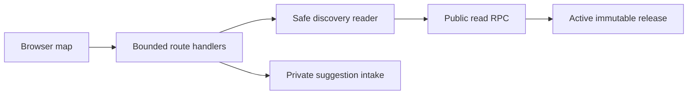

# 구조

## 제품 경로

루트 지도는 장소를 검색하고 필터링한 뒤, 지도 마커나 결과 목록에서 상세를 엽니다. 상세를 닫으면
연 경로에 따라 같은 결과 항목 또는 마커로 포커스를 돌려 키보드와 보조기술 사용자가 맥락을 잃지
않게 합니다. 모바일 상세는 지도와 분리된 한 개의 스크롤 영역을 사용합니다.

`/suggest`는 장소나 메뉴의 변경 제안을 받습니다. 제안은 자동으로 공개 지도 데이터를 바꾸지 않으며,
서버가 안전한 입력 경계를 통과한 내용만 비공개 검토 흐름으로 전달합니다.

## 읽기 경계

브라우저는 `/api/places`와 장소 상세 API를 통해 필요한 결과만 요청합니다. 서버는 구성된 발견용
데이터베이스의 공개 읽기 RPC를 호출하고, 요청 크기·필터·페이지 크기를 제한한 DTO만 반환합니다.
원본 자료, 운영 메모, 비밀값, 검토 근거는 이 경계를 통과하지 않습니다.

데이터는 변경 불가능한(immutable) 릴리스 단위로 활성화됩니다. 읽기 응답은 릴리스와 유효 시각을
함께 확인하며, 검증을 통과한 공개 응답만 제한된 캐시에 둘 수 있습니다. 릴리스가 바뀌거나 근거의
유효 경계가 지나면 서버는 이전 응답을 재사용하지 않습니다. 이 설계는 최신성을 위한 경계이며,
성능 수치나 운영 환경 검증을 대신하지 않습니다.

## 외부 서비스

지도 타일과 마커는 NAVER Maps SDK가 렌더링합니다. 선택적 분석은 별도 공개 구성값으로만 초기화되고,
개인 식별 정보나 원시 위치·주소를 분석 속성으로 보내지 않습니다. 지도 SDK 또는 데이터베이스 구성이
없으면 앱은 데이터를 만들어 내지 않고 사용 가능한 오류 또는 빈 상태를 표시합니다.
